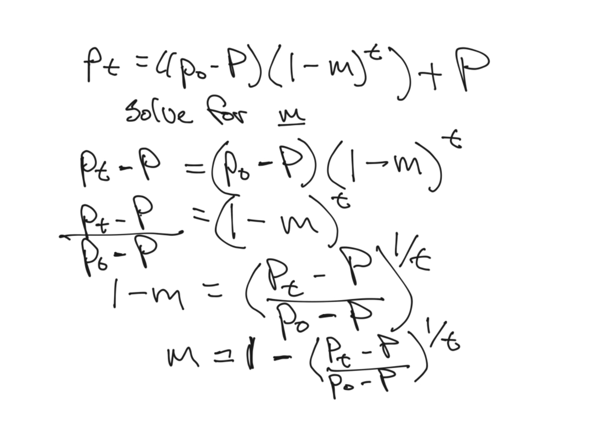

### Problem 3
A large population of *Drosophila melanogaster* has been subdivided into 64 lines of constant census size *N* = 40 that are maintained with panmixia for 50 generations. A biallelic genetic marker is found in generation *t* = 0 with allele frequency *q*<sub>0</sub> = 0.4 for the minority allele. Calculate for generation *t* = 50:

(a) the expected frequency of the allele in the lines.

The primary evolutionary force being considered in this question is genetic drift. Specifically, there is no indication that for the focal locus one or the other allele is differentially fit. While it's not explained analytically, we see on page 26 that the mean expected frequency of the focal allele across our different lines is the same as the initial frequency, so *q*<sub>50</sub> = 0.4

(b) The expected variance of the allele frequencies between the lines.

The expected variance at *t* = 50 (or any particular generation) is given in equation 2.9 on page 25, $\sigma_{q_t}^2$ = p<sub>0</sub>q<sub>0</sub>$[1 - (1 - \frac{1}{2N})^t]$, so

```
40
t <- 50
q <- 0.4
p <- 0.6
N <- 40
qsquared <- p*q*(1-(1-(1/(2*N)))^50)
print(qsquared)
[1] 0.1120423
```
(c) The expected heterozygosity for the marker

We can see from equation 2.11 that the expected heterozygosity is equal to 2p<sub>0</sub>q<sub>0</sub> - 2$\sigma_{q_t}^2$

```
h <- 2*p*q - 2*qsquared
print(h)
[1] 0.2559154
```
### Problem 4
The frequencies of an allele in four island populations between which migration is assumed to occur at a rate *m* = 0.1 per generation are 0.3, 0.2, 0.4, and 0.1, respectively. 

(a) What will be the allele frequencies on each island after 10 generations? And after 50?

We can solve this question with a slight modification to equation 2.16, specifically *p<sub>t</sub>* = ((*p<sub>0</sub>* - *P*)(1 - *m*)*<sup>t</sup>*) + *P*, where *P* is the average frequency across all populations and *p* is the frequency of an allele in a specific population. 

```
mean_p <- (0.3+0.2+0.4+0.1)/4
p1 <- 0.3
p2 <- 0.2
p3 <- 0.4
p4 <- 0.1
m <- 0.1
t <- 10
p1_10 <- ((p1-mean_p)*(1-m)^t)+0.25
p2_10 <- ((p2-mean_p)*(1-m)^t)+0.25
p3_10 <- ((p3-mean_p)*(1-m)^t)+0.25
p4_10 <- ((p4-mean_p)*(1-m)^t)+0.25
print(p1_10)
print(p2_10)
print(p3_10)
print(p4_10)
[1] 0.2674339
[1] 0.2325661
[1] 0.3023018
[1] 0.1976982
```
```
t2 <- 50
p1_50 <- ((p1-mean_p)*(1-m)^t2)+0.25
p2_50 <- ((p2-mean_p)*(1-m)^t2)+0.25
p3_50 <- ((p3-mean_p)*(1-m)^t2)+0.25
p4_50 <- ((p4-mean_p)*(1-m)^t2)+0.25
print(p1_50)
print(p2_50)
print(p3_50)
print(p4_50)
[1] 0.2502577
[1] 0.2497423
[1] 0.2507731
[1] 0.2492269
```
So the population have moved towards the mean of the whole metapopulation!

(b) If an allele frequency of 0.275 is estimated for the first island in generation 10, what would be the most likely estimate of the migration rate?

The solution here is very similar to that of (a) in that we're going to use a version of equation 2.16 to solve the problem. In (a) we knew everything except *p<sub>t</sub>* while now we know everything except *m*. So let's rearrange the equation and plug our numerical values in. First, the algebraic rearrangment: 



*m* = 1 - [(*p<sub>t</sub>* - *P*) / *p<sub>0</sub>* - *P*)]<sup>(1/t)</sup>, then the numeric part,

```
m1 <- 1 - ((0.275-0.25)/(0.3-0.25))^(1/10)
print(m1)
[1] 0.06696701
```
So that's the new migration rate!